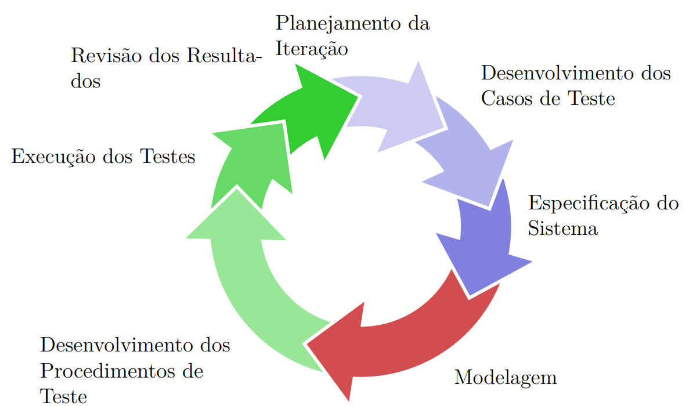

# Elevator Control Design and Validation

O projeto atual é desenvolvido para avaliar o desenvolvimento de um
sistema de controle para elevadores baseado na metodologia de
model-based design (MBD). O projeto, em conjunto com a documentação
presente elicitar o proceso de desenvolvimento contínuo tanto das
definições de projeto, como das atividades técnicas desempenhadas.

## Ciclo de Desenvolvimento

Apoiado nas práticas ágeis, este projeto deve:

- Elicitar `requisitos` para o projeto
- Desenvolver `casos de teste` para estes requisitos
- Elicitar `especificações` para o atingimento dos requisitos e
    objetivos específicos do ciclo.
- Desenvolver `modelos do sistema` e `modelos do controle`
- Desenvolver `procedimentos de teste` e automações para tais
- Validar em plataforma HIL os artefatos desenvolvidos (Software e modelos)
    frente aos artefatos de projeto como especificações e requisitos.
