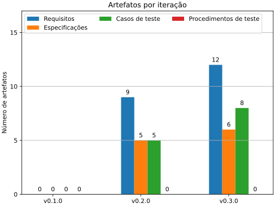
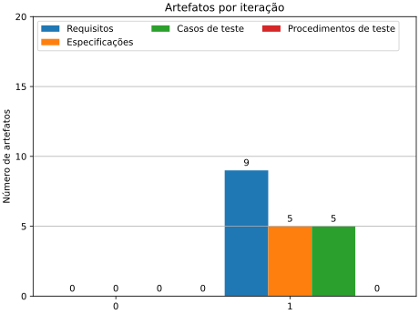

# Notas Compiladas

## 0.3

### Planejamento da Iteração

Dado à experiência dos desenvolvida no último ciclo verifica-se a necessidade
de:

- Implementar um algoritmo de controle para o acionamento das chaves do
    inversor.
- Desenvolver os modelos de sistema de potência, motor e carga para
    verificação da função sob cargas simplificadas.

Para tal objetivo o ciclo deve elicitar:

- Requisitos para o controlador
- Especificações a serem investigadas
- Casos de teste que possam ser facilmente aferidos

Para a eficiência desse ciclo, desenvolvimento de procedimentos de teste
devem ser postergado e reavaliados para o próximo ciclo.

Como objetivo geral do ciclo requisitos funcionais para a operação do
do controlador sob o motor foram definidos em [REQ-100](../artifacts/requirements.md#req-100), [REQ-110](../artifacts/requirements.md#req-110) e [REQ-120](../artifacts/requirements.md#req-120).

### Desenvolvimento dos Casos de Teste

Cada novo requisito teve uma cobertura estabelecida, porém é conveniente
mais testes sejam inclusos de forma a observar condições adicionais de
falha para o requisito.

Essa ampliação de testes será postergada dado que deseja-se verificar um
sistema que implemente funções que de fato requeiram testes.

### Especificação do Sistema

Deseja-se apresentar um sistema que opere o motor em condições de carga
evitando operações inadequadas do sistema de chaveamento. Para isso o
ciclo deve testar diferentes opções de malha de controle, em especial o
controle de campo orientado (em inglês, FOC).

### Modelagem

O ciclo se concentrou em duas atividades principais: refatorar o modelo
do controlador e refatorar o modelo de simulação.

### Refatoração do modelo do Controlador

A refatoração do modelo necessitou o mapeamento das portas GPIO do
controlador do motor do elevador com as portas de aquisição do sistema
Speedgoat.

Portas mapeadas disponíveis para atuar como sinal de chaveamento dado
a configuração FPGA atual (Bitstream HIL) segue:

| Texas Instruments | Speedgoat |
| ----------------- | --------- |
| GPIO0             | CAP 2     |
| GPIO1             | CAP 6     |
| GPIO2             | CAP 4     |
| GPIO3             | CAP 1     |
| GPIO4             | CAP 5     |
| GPIO6             | CAP 3     |

A porta GPIO5 não será utilizado com o propósito de chaveamento do
inversor uma vez que esta está alocada no canal de aquisição de
encoder da FPGA.

A aquisição de sinais depende de um mecanismo de temporização do tempo
de amostragem e sequenciamento da aquisição pelo controlador. Entre os
mecanismos apresentados está atrelado à vinculação do gatilho do ADC a
um dos blocos PWM da controladora TI.

Algumas notas para a configuração para o bloco PWM (configurado pelo
bloco simulink para o controlador TI em questão) são:

```note
PWM requerem:
    - Determinação das propriedades principais de temporização na página geral.
        - Período em clocks.
        - Janela de conversão Analog to Digital (mínimo 7 clocks).
        - Modo de contagem: Incremento positivo e reset:0, Incremento negativo e reset:peíodo, Incremento positivo e depois negativo.
        - Diversos:
            - Configurações para sinal de sincronização (múltiplos sinais podem ser resetados para ficarem em fase).
            - Configurações de divisor temporal para taxas menores.
    - Configuração de comparadores para até dois triggers independentes (usual utilizar metade do ciclo) . (Talvez não seja necessário)
    - Configuração do trigger de evento propriamente, com opção de quantos triggers de comparador são necessários para gerar um evento (1,2 ou 3).

ADC requerem:
        - Uma fonte de triggers (para aquisições síncronas, com o PWM).
        - O uso do ADCINT1 parece ser necessário para encadear a conversão do sinal A. Do contrário só está gerando uma aquisição instantânea quando o sinal transita de alto para baixo.
```

### Refatoração do modelo de simulação

A refatoração do modelo teve por objetivo sanar problemas de execução apresentados até o estado inicial do ciclo. Havia por hipótese que as
falhas estavam restritas a falhas na integração dos modelos, parâmetros
não contidos no modelo atual e configurações ainda não explorada. A
atividade apresentou duas fontes críticas para a falha não previamente
prevista ou explorada na ferramenta.

### Defeito nas dependências de compilação para Realtime no Matlab/Simulink 2024a

Após diversos testes serem conduzidos sob o sistema, desde exclusão
gradual de elementos do modelo, criação de modelos simplificados com
os elemento em análise, verificação de logs de *crash* e ainda relatórios
de compilação verificou-se que novas versões do Matlab e do arquivo de
compilação para o alvo de tempo-real Speedgoat introduziram defeitos
na ferramenta. A primeira tentativa buscou regredir uma subversão para
o Matlab/Simulink 2024a. Após nova bateria de testes, com o defeito
ainda sendo reproduzido optou-se por regredir para a versão 2023b
da ferramenta.

Após a regressão, refatoração extensa do projeto, substituição dos arquivos gerados na versão 2024a e exclusão de todos os arquivos de teste não
pertencentes ao código fonte em desenvolvimento foi obtido uma versão
estável do projeto, porém com necessidade de prosseguir com a integração
dos modelos no projeto.

### Defeito no Multibody Toolbox para modelos de frequência múltipla

Ao realizar testes individuais em cada modelo, determinou-se que a
integração deveria ser apoiada por testes de performance para cada
modelo. Dessa forma verificou-se tempos de execução para cada
submodelo e frequência desejada de avaliação de cada um para obtenção
de simulações precisas e estáveis. Durante a integração verificou-se
que modelos baseados em Simulink Multibody sofrem de dois problemas:

- Quando atribuídos com solver local, a ferramenta falha em transpilar
    o código corretamente. O problema apresentado aparenta ser inédito
    e as investigações atuais indicam a ausência de dependências para
    compilação para tempo-real da toolbox, impossibilitando o uso um
    solver local no contexto de tempo real.
- Quando atribuídos com um solver global, a ferramenta é atribuída com
    o menor tempo de amostragem presente globalmente no modelo. Este
    comportamento ignora tanto a taxa de amostragem de sinais de entrada
    e supõe-se que este efeito existe em função de dependências internas
    da ferramenta com configuração de tempo de amostragem do tipo contínuo
    (que é discretizado na maior frequência de avaliação).

Após experimentos em busca de desacoplar os modelos e suas taxas de
amostragem, verificou-se que de fato o defeito inviabilizaria o uso
de taxas distintas para o modelo mecânico e o elétrio. Enfim, optou-se
pelo uso de uma taxa única de 500 Hz que viabilizaria tanto o modelo
mecânico de ser executado dentro do tempo de um único passo, quanto
para o elétrico de gerar simulações consistentes às primeiras simulações
em 1000 Hz. 

### Considerações adicionais

Dado às mudanças na estrutura do modelo, decidiu-se que o modelo
do inversor por chaves deveria ser substituído por um modelo com
base no Duty Cycle mensurado, o que tranferiria o custo computacional
do processamento em CPU da aquisição das amostras para a FPGA
assim como seria mais adequado a taxa de amostagem limitada a 500 Hz
para a execução do modelo.

### Desenvolvimentos dos Procedimentos de Teste

Para apoiar o desenvolvimento de modelos e verificar a manutenção da
funcionalidade dos modelos desenvolvidos, foram implementados que
verificam unitariamente e integrados sete testes, do quais seis deles
se mantiveram ativos para garantir a sanidade destes para execução
do teste em tempo real. Os testes desenvolvidos além de intrinsecamente
verificar que modelos passam pela etapa de compilação também aferem
se modelos são executados abaixo da margem máxima de tempo de execução
para qualquer momento durante a simulação assim como não apresentam
"overload" (execução além do tempo do passo da simulação).

### Execução dos Testes

Os testes apresentam tempos de execução adequados para frequências
de avaliação de 500 Hz ou 0.002 ms. 

### Revisão dos Resultados

O ciclo atual não permitiu que os objetivos estabelecidos
inicialmente pudessem ser estabelecidos em função de das
limitações técnicas verificadas no decorrer do ciclo.
Dessa forma o ciclo foi capaz de estabelecer novos artefatos
que correlacionam os objetivos iniciais do projeto com
propriedades com maior correlação à propriedades físicas
dos sistemas em estudo.

Apesar dos problemas enfrentados, soluções foram estabelecidas
para que o desenvolvimento e simulação possam seguir e que
novos problemas correlacionados à performance e execução dos
modelos a partir de testes automatizados, reduzindo o risco
de regressão dos modelos durante futuras alterações nos modelos.

Uma relação dos artefatos do projeto é dada pelo gráfico que segue:



### Considerações para ciclos subsequentes

Modularização das funções do software e estabelecimento de método
de modos de execução que permitam que testes em modo desenvolvimento
possam verificar progressivamente funções ou encadeamento de funções
(integralção de funções) de maneira a garantir que o software é
facimente válidado.

Ainda, pondera-se que, uma vez que o projeto é desenvolvido invidualmente
que novas iterações sejam especializadas em algum tópico do ciclo
proposto de maneira a reduzir o impacto sobre a produtividade a
cada troca nos tópicos do desenvolvimento. A especialização não
deve impedir que outras etapas sejam atendas, mas que sim que estas
devem ser dadas como opcionais ou secundárias frente à atividade
em foco.

## 0.2

### Objetivos da iteração

Conforme estabelecido no ciclo 0, onde foram arranjados os recursos mínimos para o início de um ciclo de desenvolvimento, foram determinados os seguintes tópicos a serem atendidos:

- Preparar os casos de teste, procedimentos de teste e os outros
    artefatos do projeto para estabelecer um **framework** de
    registro das atividades para um ciclo completo.
- Gerar modelos referenciados, operacionais ou não, para os
    elementos do sistema (e.g. elevador, motor, acionamento de
    potência).
- Determinar interfaces para estes modelos.
- Referenciar modelos à testes unitários de demonstração.
- Rastrear modelos à requisitos de demonstração.

### Resultados da iteração

Durante esta etapa de desenvolvimento, o desenvolvimento do sistema de artefatos do projeto atendeu o registro dos requisitos originais e com derivação preliminar destes. Artefatos de casos de teste e especificação também foram elicitados conforme norma ou mantidos em aberto para especificação subsequente.

Quanto ao processo de modelagem, no contexto do ambiente simulado foram desenvolvidos submodelos referenciados para:

- Interface de Hardware
    Modelo implementa funções de aquisição e geração de sinais e representa o controlador no modelo.
- Inversor Trifásico
    Modelo que representa uma fonte de tensão trifásica que é chaveada pelos sinais de chaveamento do controlador.

Estes modelos modelos ainda foram interfaceados a um modelo de motor síncrono e um modelo de carga mecânica genérica.

No contexto da aplicação de controle, um modelo a parte foi desenvolvido capaz de chavear seis portas TTL de forma independente. Também foram validados processos de decodificação de sinais de encoder, e outros. O modelo foi compilado e embarcado de forma a realizar a comutação seriada das chaves inversoras a partir de fontes de pulsos ajustados manualmente. Dessa forma foi possível verificar uma integração básica entre o software embarcado e grandezas no motor como torque, velocidade e posição do sistema.

Dada o excessivo tempo da iteração corrente, optou-se por fechar o ciclo sem mapeamento de modelos à artefatos uma vez que o estado atual dos modelos e do controlador não implementam nenhuma propriedade planejada. Dessa forma, em posse de maior contexto para o projeto, novos artefatos podem ser descritos, novas decisões de projeto elicitadas e modelos podem ser desenvolvidos de maneira mais concisa em relação ao problema.

A seguir é apresentado a contagem corrente de artefatos do projeto:



### Considerações para iterações subsequentes

O uso de requisitos funcionais de forma independente pode reduzir a carga de trabalho na elicitação de requisitos até que o controlador e os modelos atinjam funcionalidades mais alto nível. Nesse sentido, requisitos independentes podem receber traceabilidade ao avançar do projeto, evitando a criação de requisitos, especificações e outros artefatos que não contribuam no ciclo corrente.

O modelo de interface do controlador está operando à uma baixa taxa de amostragem (1kHz). Deve ser  suficiente para testar o algoritmo a baixas frequências de operação, mas deve ser revisto ao estender a frequência de operação.

Para o próximo ciclo sugere-se:

- Desenvolver a malha de controle do Controlador de forma à obter uma sequência de chaveamento consistente.
- Implementar sensores nos modelos para o monitoramento de variáveis de interesse que possam subsequentemente ser implementados em testes.

## 0.1

- Not developed